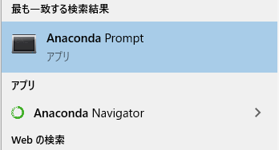
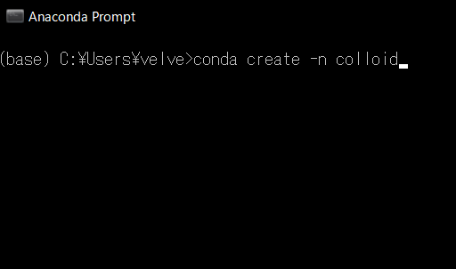

# OpenCV-Pythonを用いた動画・画像処理レッスン
## 〜 コロイド粒子の結晶化を用いて 〜
by Kohei Ishikawa (aka konkon)  
E-mail: ishikawa@unno.material.nagoya-u.ac.jp

## はじめに
このリポジトリは、コロイド粒子の結晶化動画の画像処理方法をJupyter-notebook形式でまとめたものです。  
それぞれのノートブックの内容は以下の通りとなります。  

1. MakeSample.ipynb - 動画からの画像サンプリング
2. ParticleDetection.ipynb - コロイド粒子の検出と秩序変数の解析
3. MovieAnalysis.ipynb - 画像処理・解析の全自動化

1〜3の順に読み進めていけば、動画からの画像解析の一連の流れがわかるようになっています。
なっているはずです(願望)。

## 環境構築の方法
### Anacondaのインストール
Pythonのインストールには、Anacondaを使うのが便利です。  
https://www.anaconda.com/distribution/#download-section  
上のURLから、環境に応じたインストーラーを入手して導入してください。
(間違ってもPython 2.x versionをインストールしないように)  
  
インストール方法は適当にネットに転がってる記事を参考にしてください。  
https://ai-inter1.com/python-install/
↑これとか。

### Python環境の作成
Anacondaを導入できたらAnacondaPromptを起動してください。

コマンドプロンプトが開くので、以下のように入力してください。

```
conda create -n "好きな名前"
```


"好きな名前"が新しい環境の名前になります。画像では"colloid"です。  
エンターを押すとy/nと確認されるのでyを押してエンターしてください。  
しばらくすればcolloidという名前のPython環境が新しく構築されます。  

### 色々とインストール
このようにできた環境にはPythonしか入ってないので、必要なものをインストールします。
まず、以下のように入力して環境を起動します。

```
activate "環境名"
```

今回は activate colloid でcolloid という名前の環境が起動します。
そうしたら、以下のように入力してエンターしてください。

```
pip install numpy scipy scikit-learn scikit-image tqdm opencv-python notebook widgetsnbextension
```

しばらくすると必要なパッケージがインストールされます。  
問題が起きたら権限当たりの問題だと思うので、Anaconda Promptを管理者権限で起動してからもう一度やってください。  
それでもうまくいかない場合は、エラーメッセージを読んで臨機応変に対応してください。  

### Jupyter-notebookのエクステンションを有効化

インストールがうまくいったら、以下のように入力して実行してください。

```
jupyter nbextension enable --py --sys-prefix widgetsnbextension
```

Jupyter-notebookのextentionを有効化する呪文です。
